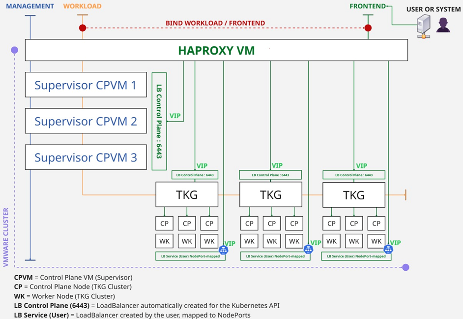
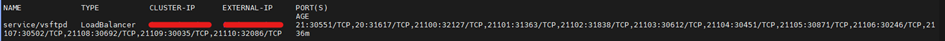
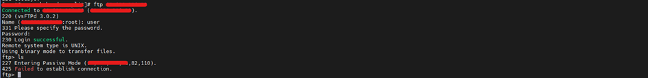
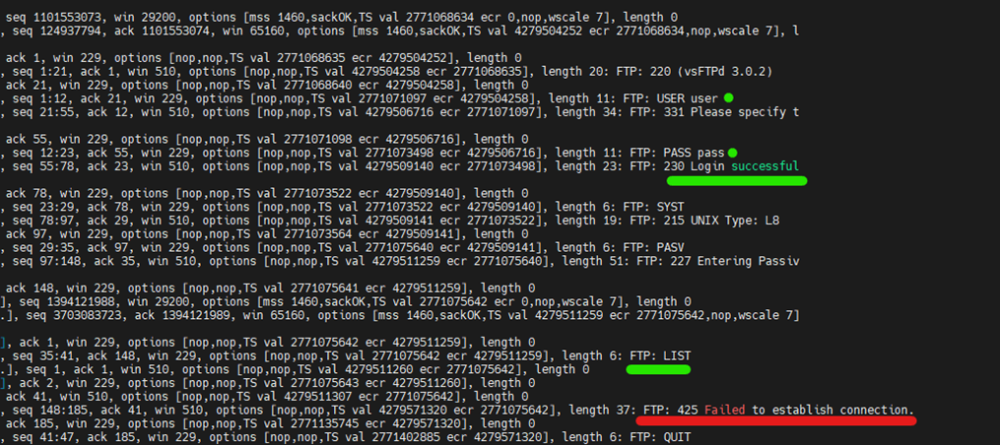
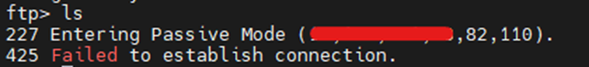
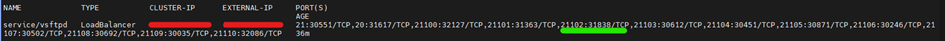
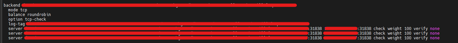
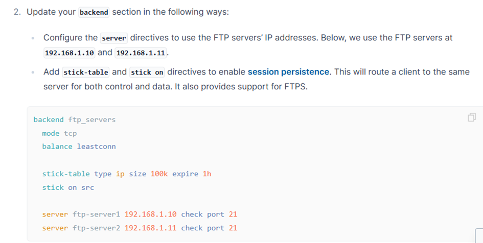
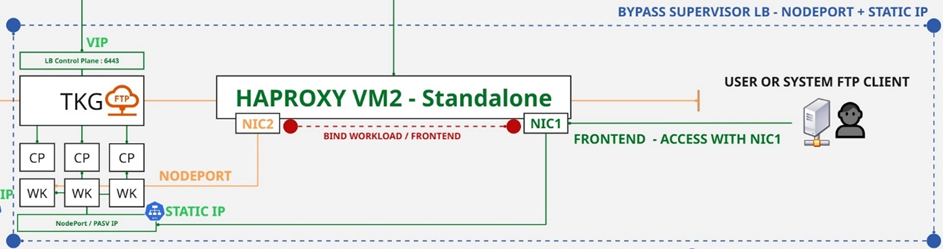
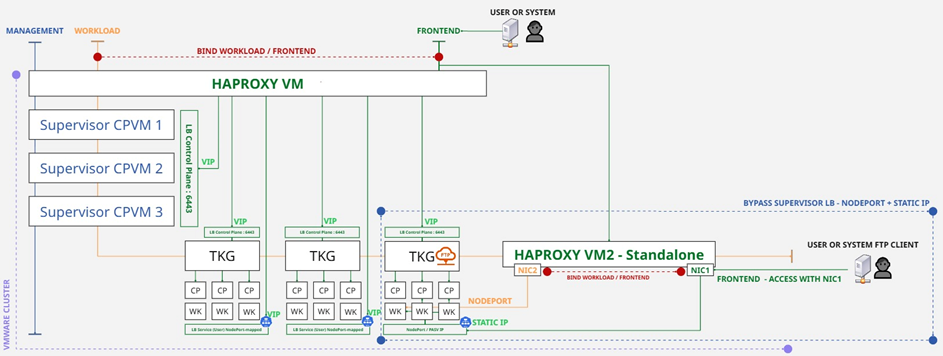

# Passive FTP Server exposure Through Standalone HAProxy on Tanzu Kubernetes Grid — Bypassing Supervisor-Managed Load Balancer Limitations via Dual-VM and NodePort Strategy 

Finding a way to support FTP within a Tanzu Kubernetes Grid (TKG) architecture on VMware proved to be challenging, with very little useful information available online. In the end, the chosen solution turned out to be relatively simple, but understanding the overall setup and, most importantly, identifying why it was not working required time and careful observation.

## Important note:
This demonstration is based on an existing environment where the Supervisor was deployed on a VMware cluster with HAProxy configured in 3-NIC mode. This setup ensures proper routing between networks using Distributed Virtual Switches (DVS) and specific port groups created for this architecture.

The objective here is not to detail the initial installation of the Supervisor or HAProxy, nor to cover global cluster hardening or hardware and software preparation. Instead, the focus is on explaining the overall load balancing mechanism and the design workaround required to get the FTP protocol running inside a TKG environment.

To set up this initial configuration, the following documentation was particularly important:

- https://techdocs.broadcom.com/us/en/vmware-cis/vsphere/vsphere-supervisor/8-0/running-vsphere-supervisor-on-vsan-stretched-cluster.html
- https://www.vmware.com/docs/vsan-stretched-cluster-guide#introduction
- https://techdocs.broadcom.com/us/en/vmware-cis/vsphere/vsphere-supervisor/8-0/installing-and-configuring-vsphere-supervisor/networking-for-vsphere-with-tanzu/install-and-configure-the-haproxy-load-balancer.html
- https://techdocs.broadcom.com/us/en/vmware-cis/vsphere/vsphere-supervisor/8-0/installing-and-configuring-vsphere-supervisor/supervisor-installation-and-configuration-workflow.html
- https://techdocs.broadcom.com/us/en/vmware-cis/vsphere/vsphere-supervisor/8-0/installing-and-configuring-vsphere-supervisor/deploy-a-one-zone-supervisor/deploy-a-supervisor-with-vds-networking.html

When deploying a Tanzu Supervisor, several networking topologies and load balancing options are available.

- **Available network topologies**:
  - Single-cluster Supervisor networking with VDS
  - Three-zone Supervisor networking with VDS
  - Supervisor networking with NSX
  - Three-zone Supervisor networking with NSX
  - Supervisor networking with NSX and Avi Load Balancer Controller
  - Three-zone Supervisor networking with NSX and Avi Load Balancer Controller

- **Available load balancing options**:
  - VDS with NSX Advanced Load Balancer
  - VDS with HAProxy (2 or 3 NICs)
  - NSX Advanced Load Balancer
  - NSX Edge Load Balancer

- https://techdocs.broadcom.com/us/en/vmware-cis/vsphere/vsphere-supervisor/8-0/vsphere-supervisor-concepts-and-planning/supervisor-architecture-and-components/supervisor-networking.html
- https://techdocs.broadcom.com/us/en/vmware-cis/vsphere/vsphere-supervisor/8-0/vsphere-supervisor-concepts-and-planning/vsphere-with-tanzu-deployment-options/topologies-for-deploying-the-haproxy-load-balancer.html

## Context used in this setup:

- **Topology**: Single-cluster Supervisor networking with VDS, combined with an Active/Active vSAN Stretched Cluster
- **Load Balancer**: VDS with HAProxy configured in 3-NIC mode

- https://techdocs.broadcom.com/us/en/vmware-cis/vsphere/vsphere-supervisor/8-0/running-vsphere-supervisor-on-vsan-stretched-cluster/active-active-configuration-for-tkg-clusters-on-vsan-stretched-cluster/configure-networking-for-active-active-deployment-modes.html

## Versions used in this setup:

- **vCenter**: 8.0.3
- **Supervisor**: v1.29.7
- **TKG**: v1.26.13
- **HAProxy**: 2.2.6

## How HAProxy works within the Supervisor:

According to the official documentation:
“When using vSphere Supervisor with VDS networking, HAProxy provides load balancing for developers accessing the TKG control plane, and for Kubernetes Services of Type Load Balancer.”

This sentence summarizes the role of HAProxy in the network architecture of a Tanzu/Supervisor environment configured with a VDS-based stack.

In practical terms:

- The deployed HAProxy acts as a single entry point to expose Kubernetes workloads to the outside world.
- It handles two main types of traffic:
  - Connections to the control planes, including both TKG clusters (attached to vSphere namespaces) and the Supervisor itself (kube-apiserver).
  - LoadBalancer services created by users within the TKG clusters, which are actually mapped to NodePorts on the Supervisor level.

## Here is how HAProxy is integrated into the configuration using a 3-NIC topology:



In an environment where HAProxy is configured with three network interfaces, the topology is built around three main segments: the Management network, the Workload network, and the Frontend network. Each one plays a specific role in the architecture:

- The **Management network** connects the Supervisor control plane VMs (CPVMs) with the HAProxy VM. This is the administrative layer used by vCenter.
- The **Workload network** carries internal Kubernetes traffic. It links the Supervisor VMs to the TKG nodes and allows HAProxy to route traffic throughout the environment. Each TKG node (control plane or worker) receives an IP from this network, based on a reserved IP range defined during deployment.
- The **Frontend network** exposes services to external users or systems. This is where LoadBalancer-type services become reachable through virtual IPs (VIPs) managed and distributed by HAProxy, using a reserved IP range configured during setup.

There are two types of LoadBalancer services handled by HAProxy and exposed through the Frontend network:

- **Control Plane LB (port 6443)**: Automatically created by the Supervisor to expose the Kubernetes API of TKG clusters.
- **User LB Services**: Created by users within TKG clusters. These services are assigned dynamic external IPs.

The Supervisor-managed HAProxy works well for standard use cases involving Kubernetes Services of type LoadBalancer. However, it quickly shows its limitations when trying to expose older or less compatible protocols, such as passive-mode FTP.

Passive FTP relies on dynamic connections, where multiple ports are opened temporarily, randomly, and on demand. HAProxy does not handle this properly in the Supervisor-managed context, mainly due to two key issues:

- Passive port bindings are not properly handled. Although the Supervisor detects and automatically sets up the passive ports in HAProxy, the resulting configuration does not follow the required best practices for FTP. In particular, the backend configuration lacks important settings such as stick-table on port 21 and avoids continuous tcp-check on passive ports, both of which are essential for proper FTP handling. See: https://www.haproxy.com/documentation/haproxy-configuration-tutorials/protocol-support/passive-ftp/

- The configuration is locked. HAProxy is fully managed by the Supervisor, which means it is not possible to manually edit /etc/haproxy/haproxy.cfg to adjust or improve the setup. This rigidity prevents any adaptation for advanced or non-standard protocols like FTP.

In this context, here is an example of an FTP deployment inside a TKG cluster, exposed using a Kubernetes Service of type LoadBalancer. The goal is to verify whether passive-mode FTP works correctly through the VIP automatically assigned by the Supervisor-managed HAProxy.

Docker image used: https://github.com/fauria/docker-vsftpd

The deployment YAML files are available in the **/demo** directory.

Once deployed, the service exposes the following ports:

- 21: FTP command channel
- 20: FTP data channel
- 21100–21110: Passive mode ports



From a client machine, the FTP server is accessed using the VIP automatically assigned as the `external-ip` of the service. This same IP is also configured inside the pod as the `PASV_ADDRESS` deployment variable.



At the same time, from the Supervisor-managed HAProxy machine, a tcpdump is run to monitor activity on the exposed ports:

**sudo tcpdump -i any port 21 or portrange 21100-21110**



FTP connection is successfully established with a `230 Login successful` response. However, as soon as a command is issued (such as `ls`), the server returns `425 Failed to establish connection`.

The FTP server correctly switches to passive mode and selects a random port from the 21100–21110 range (in this case, port 21102 calculated as 82\*256 + 110), but the data connection attempt fails.



It is observed that port 21102 is mapped to NodePort 31838 on the TKG side.



Again, from the Supervisor-managed HAProxy machine, we inspect the behavior of this NodePort (acting as the backend in this case) by running: **journalctl -xe | grep 31838**


We can see that NodePort 31838 is marked as down, with an error message referring to a failed tcp-check.

By comparing the haproxy.cfg frontend and backend configuration with the official HAProxy documentation on passive FTP support, several key mismatches become apparent:

- The backend for the control connection (port 21) should use stick-table and stick on src to ensure session persistence. This is not the case here.
- The backends for passive ports should not use standard tcp-check health checks, as these ports do not accept TCP connections unless an FTP session is already active. This check is active by default in the Supervisor-managed setup.
- It is generally recommended to disable tcp-check on passive ports and rely solely on the control port (21) to validate the server’s availability.

View of a passive port configuration automatically generated on the Supervisor-managed HAProxy:



Recommended backend configuration for passive FTP in HAProxy:



https://www.haproxy.com/documentation/haproxy-configuration-tutorials/protocol-support/passive-ftp/


**About the `PASV_ADDRESS` variable:**

The `PASV_ADDRESS` environment variable defines the IP address that the FTP server announces to clients when switching to passive mode.

In passive mode, it is the client that initiates the connection to the server on a random port within the defined passive port range (in this case, 21100–21110).
For the connection to succeed, the client must know exactly which IP address to connect to.

The FTP server uses the value of `PASV_ADDRESS` to inform clients of the correct IP during the passive mode negotiation.

In our deployment, this IP corresponds to the VIP automatically assigned by the LoadBalancer (Supervisor-managed HAProxy).
It is therefore critical that `PASV_ADDRESS` is correctly set to the external IP visible on the Kubernetes service. Otherwise, the passive connection will fail.


## Observation and conclusion

This demonstration confirmed that passive-mode FTP does not work when exposed through a VIP automatically assigned by the Supervisor-managed HAProxy:

- The backend configuration is not suitable for handling passive ports, which change dynamically with each connection.
- It is not possible to modify the HAProxy configuration to adjust its behavior and align with recommended networking best practices, as outlined in the official documentation.

## Proposed solution to work around the issue:
Deploy a second HAProxy instance as a standalone VM, completely independent from the Supervisor. This VM should be connected to both the Workload and Frontend networks.

This approach provides full control over frontend and backend configuration without any restrictions, making it possible to apply the official HAProxy settings for passive FTP. It also remains fully consistent with the existing architecture.



**Bypass architecture overview**

- A second standalone HAProxy VM is deployed with two network interfaces:

  - **NIC1** is connected to the same 'Frontend network' as the Supervisor and TKG components, and is used for client access.
  - **NIC2** is connected to the same 'Workload network' as the Supervisor and TKG nodes, and is used for internal traffic between the HAProxy VM and the Kubernetes nodes.

- FTP service exposure inside the TKG cluster:

  - The FTP server is exposed using a Kubernetes NodePort service across the worker nodes, with explicitly defined ports for:

    - FTP command port: 21
    - FTP data port: 20
    - Passive port range: for example, 21100–21110

- The standalone HAProxy VM redirects client FTP traffic to the corresponding NodePorts on the TKG nodes.

**Advantages**

- Full control over HAProxy configuration (health checks, session stickiness, timeouts, logging, etc.)
- Full compatibility with passive-mode FTP
- Decoupling the Load Balancer from the Supervisor, avoiding configuration constraints imposed by Tanzu

## Overview – Extended Architecture



This approach preserves the original architecture for standard traffic flows (Kubernetes APIs, traditional LoadBalancer services), while adding a dedicated layer to handle FTP traffic with more advanced and flexible network control through the second HAProxy instance.

## Standalone HAProxy installation

In this demo, the second HAProxy instance is deployed on a Red Hat virtual machine with two network interfaces. The installation steps are as follows:

```bash
sudo dnf install -y haproxy
sudo systemctl enable haproxy
sudo systemctl start haproxy
```

## Setting up the FTP server with the new architecture
To deploy an FTP server that meets the requirements of the FTP protocol while leveraging the new standalone HAProxy VM, a ready-to-use solution has been developed in the form of a Helm chart: **kubeftp-proxy-helm**.

https://github.com/adrghph/kubeftp-proxy-helm

This chart allows quick installation of a vsftpd server inside a Kubernetes cluster, exposing all necessary ports for passive FTP (21, 20, and a defined range of passive ports) using explicitly configured NodePorts. These NodePorts are then used by the standalone HAProxy VM to route incoming FTP traffic to the correct nodes within the cluster.

## Deployment steps

1 - Clone the repository:

```bash
git clone https://github.com/adrghph/kubeftp-proxy-helm.git
cd kubeftp-proxy-helm
```

2 - Configure values.yaml:

Adjust the following parameters to match your environment:

- `pasvAddress`: Public IP of the standalone HAProxy VM (Frontend interface / NIC1)
- `service.nodePortCommand`: For example, `30021` for FTP command port (21)
- `service.nodePortData`: For example, `30020` for FTP data port (20)
- `service.nodePortPassiveMin`: Set to `32100`, and `pasvMinPort` to `21100` (continue up to 21110) for passive ports
- `haproxy.nodesIPs`: Internal IPs of the worker nodes within the Workload network

3 - Deploy via Helm in a dedicated namespace:

```bash
helm install vsftpd . --namespace ftp --create-namespace
```

4 - Retrieve the HAProxy configuration generated by the chart:

```bash
kubectl get configmap vsftpd-haproxy-config -n ftp -o jsonpath='{.data.haproxy\.cfg}' > haproxy.cfg
```

5 - Deploy the configuration to the standalone HAProxy VM:

```bash
sudo cp haproxy.cfg /etc/haproxy/haproxy.cfg
sudo systemctl restart haproxy
```

6 - FTP client connection:

Once the HAProxy VM is properly configured and firewall rules are open (for TCP ports 20, 21, and 21100–21110), connecting is straightforward:

```bash
ftp <haproxy_public_ip>
```

## Result

- The FTP server remains functional even if the Kubernetes Pod is rescheduled or moved.
- Fine-grained port handling is fully managed through the standalone HAProxy, independently of the Supervisor.
- The service is highly available and fully compliant with the requirements of passive-mode FTP.

## Conclusion
Exposing a passive FTP server in a Tanzu Kubernetes Grid environment using the Supervisor-managed HAProxy is not compatible, mainly due to the configuration restrictions enforced by the Supervisor and the lack of native support in HAProxy for the dynamic nature of the passive FTP protocol.

To overcome these limitations, deploying a standalone HAProxy VM connected to both the workload and frontend networks offers a reliable, flexible, and standards-compliant solution. It enables fine-grained port management, session persistence, and full configuration control in line with HAProxy best practices.

This hybrid design—where standard traffic continues to be handled by the Supervisor-managed HAProxy and protocol-specific traffic is offloaded to a dedicated instance—paves the way for a modular and scalable architecture. It demonstrates that it is possible to reconcile the constraints of a tightly managed platform with the requirements of more complex protocols, by maintaining control where it truly matters.

To further enhance this setup, introducing high availability for the standalone HAProxy VM (using Keepalived or a similar solution) would ensure maximum resilience without compromising the flexibility gained.
